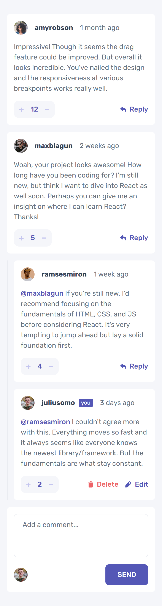
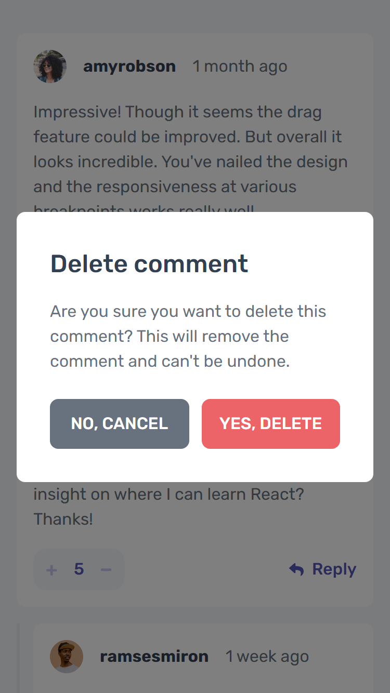
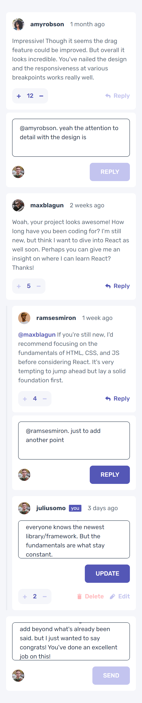
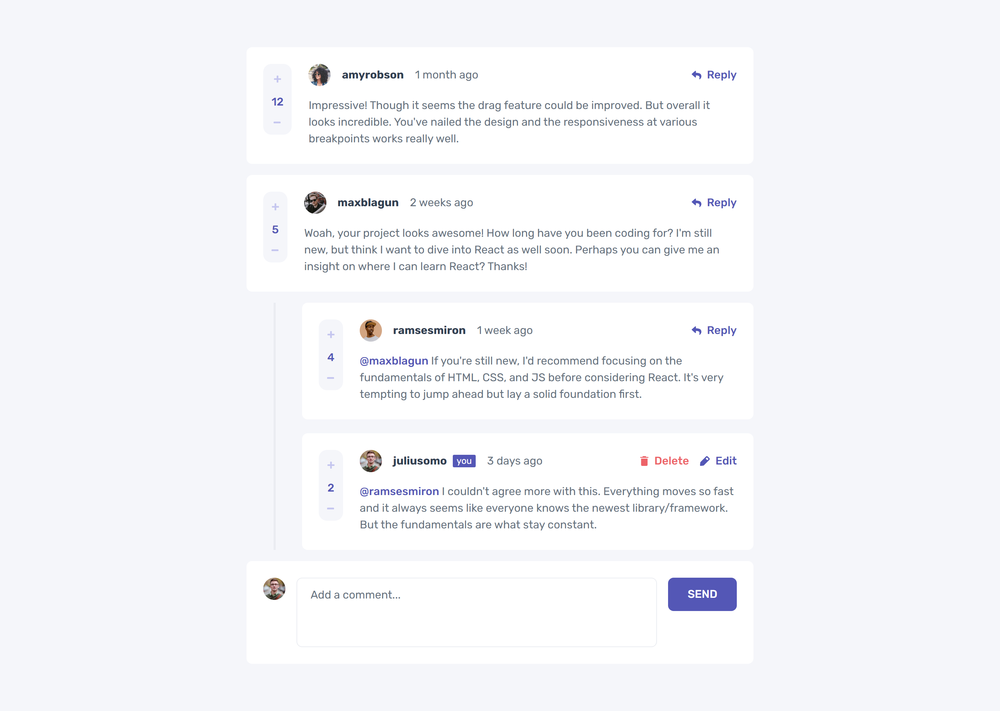
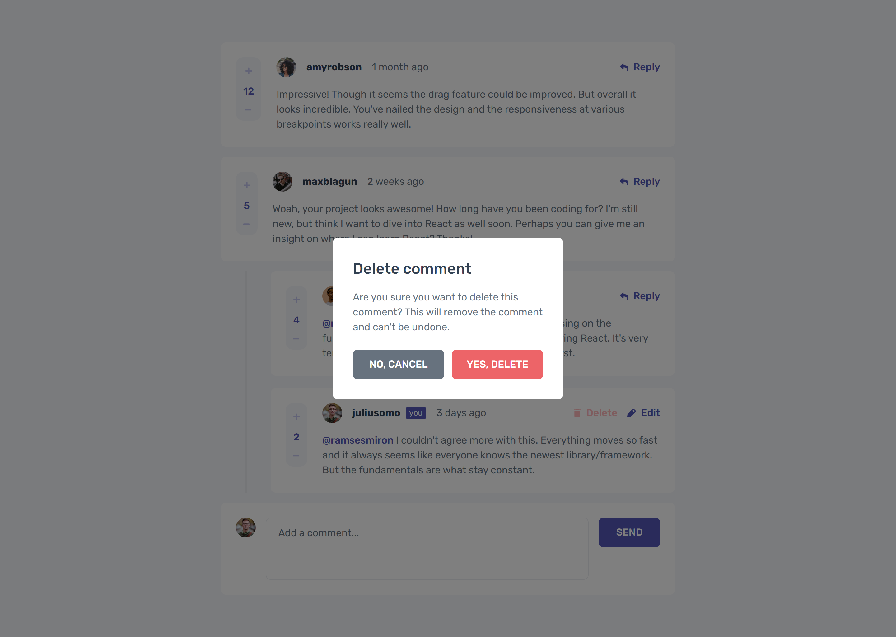
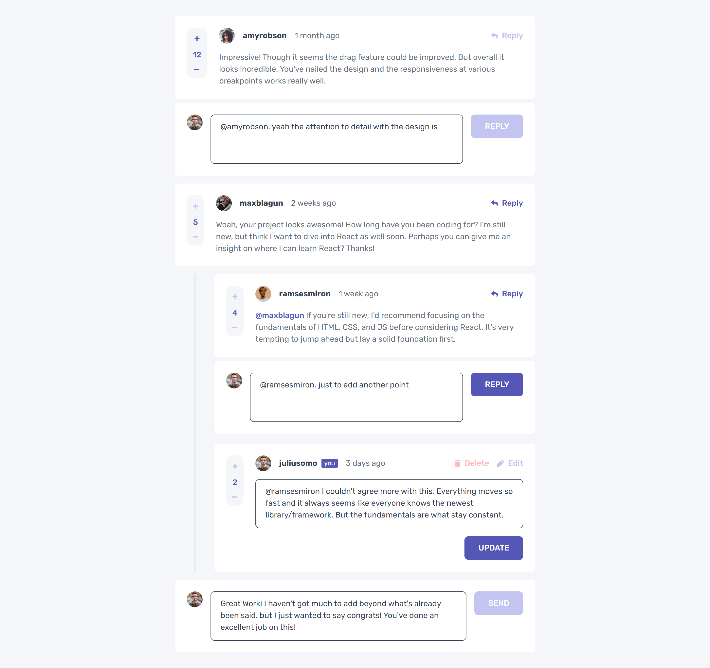

# Frontend Mentor - Interactive comments section solution

This is a solution to the [Interactive comments section challenge on Frontend Mentor](https://www.frontendmentor.io/challenges/interactive-comments-section-iG1RugEG9). Frontend Mentor challenges help you improve your coding skills by building realistic projects.

## Table of contents

- [Overview](#overview)
  - [The challenge](#the-challenge)
  - [Screenshot](#screenshot)
  - [Links](#links)
- [My process](#my-process)
  - [Built with](#built-with)
  - [What I learned](#what-i-learned)
  - [Continued development](#continued-development)
- [Author](#author)

## Overview

This is the fourth project in **Intro to JavaScript Frameworks Frontend Mentor Roadmap**. this is also the first project I did on **Frontend Mentor** that is of an **Intermediate** difficulty level. and the difficulty does show.

It was complex to implement and design because of the different interactions involved. essentially it's a small CRUD app for comments.

Tho since I'm only using **React + Vite + TypeScript**. I only made it on the frontend. so it only uses the state stored in react. it has some kind of persistency since the react state is synchronized with **localStorage**.

### The challenge

Users should be able to:

- View the optimal layout for the app depending on their device's screen size **(DONE)**
- See hover states for all interactive elements on the page **(DONE)**
- Create, Read, Update, and Delete comments and replies **(DONE)**
- Upvote and downvote comments **(DONE)**
- **Bonus**: If you're building a purely front-end project, use `localStorage` to save the current state in the browser that persists when the browser is refreshed. **(DONE)**
- **Bonus**: Instead of using the `createdAt` strings from the `data.json` file, try using timestamps and dynamically track the time since the comment or reply was posted. **(DONE)**

### Screenshot

#### Mobile

##### Mobile Normal View

##### Mobile Modal View

##### Mobile Active View

#### Desktop

##### Desktop Normal View

##### Desktop Modal View

##### Desktop Active View

### Links

- Solution URL: [Add solution URL here](https://your-solution-url.com)
- Live Site URL: [Add live site URL here](https://your-live-site-url.com)

## My process

### Built with

- Semantic HTML5 markup
- CSS custom properties
- Flexbox
- CSS Grid
- Mobile-first workflow
- [React](https://reactjs.org/) - JS library
- [TypeScript](https://www.typescriptlang.org/) - Type Checking Language Built on top of Javascript.
- [Vite](https://vitejs.dev/) - Bundler and development environment for Frontend.

### What I learned

This was a tough one to start on. as this is the first project I've done that is close to a fully featured small application.

I started by looking at the interface and dividing it into components. the main components in this project are:

- **ComponentWithReplies:** this component we pass it one comment object and it renders the comment along with it's replies offseted a little bit to the left to indicate ownership.
- **Comment:** this is the component used to render comments and replies alike. from the interface there is no practical difference. so I made it work for both of them.
- **AddComment:** this is the form under the bottom of the page used to add a comment. but it also shows when the user is replying to a comment.

There are other low level component such as the **Vote, PostButton, ActionButton** and also the **Comment** Component is further divided into subcomponents that was a little refactoring because it was getting quite long.

The state is scaled up using **Context and Reducer**. the state is managed by the **useReducer**
hook. and the state plus the dispatch function is passed to all children via a context provider that wraps the root component. so we can read the state / dispatch actions to update the state from anywhere in the tree without relying on props.

The state logic is in the **Provider / CommentsProvider.tsx** file.

I also created a couple of custom hooks. to handle reading the different contexts. and using local storage.

### Continued development

It was very fun working on this project. though it was overwhelming at first. it was also challenging. and I think this was great practice.

Thinking about improving the UX was also something that I kept in mind in this project and I implemented what seemed for me as good features. such as clicking outside the comment while editing or replying will cancel the editing or replying, when editing or replying the textarea is autofocused and the cursor is at the end. and so on.

The next and final project on this roadmap is also of **intermediate level**. so can't wait to tackle that one.

## Author

- Frontend Mentor - [@ilyesab](https://www.frontendmentor.io/profile/ilyesab)
